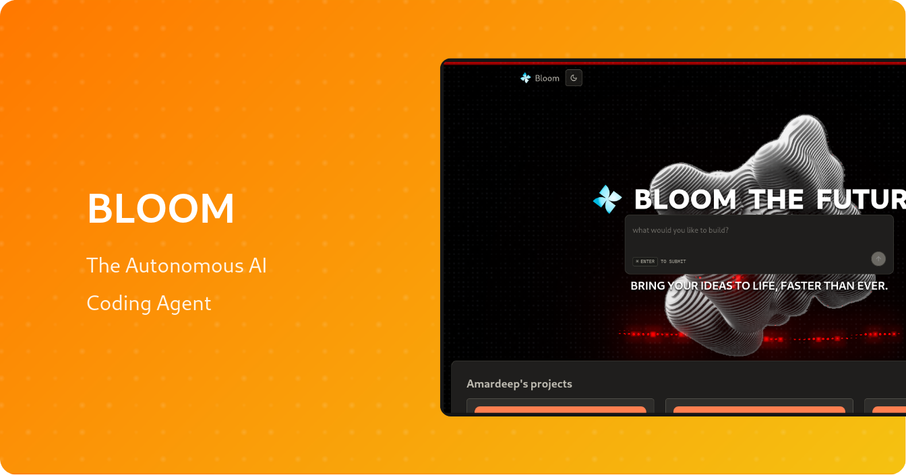

<div align="center">
  
  
  # 🌸 Bloom - AI-Powered Code Generation Platform
  
   

  <p align="center">
    <strong>Transform your ideas into production-ready code with intelligent AI agents</strong>
  </p>
  
  <p align="center">
    <a href="#features">Features</a> •
    <a href="#quick-start">Quick Start</a> •
    <a href="#tech-stack">Tech Stack</a> •
    <a href="#installation">Installation</a> •
    <a href="#usage">Usage</a> •
    <a href="#contributing">Contributing</a> •
    <a href="#license">License</a>
  </p>
  
  <p align="center">
    
    
    
    
  </p>
</div>

---

## 🚀 Overview

**Bloom** is a cutting-edge AI-powered code generation platform that helps developers transform their ideas into production-ready applications faster than ever. With intelligent AI agents, real-time collaboration features, and seamless development workflows, Bloom revolutionizes how we build software.

Created by **[amardeeplakshkar](https://github.com/amardeeplakshkar)**, Bloom empowers developers to:
- 🤖 Generate high-quality code with AI assistance
- ⚡ Accelerate development workflows
- 🎯 Focus on creativity while AI handles the implementation
- 🔄 Iterate rapidly with intelligent suggestions

## ✨ Features

### Core Features
- **🧠 AI-Powered Code Generation** - Smart agents that understand your requirements and generate optimized code
- **💬 Interactive Chat Interface** - Natural language interaction with AI for code generation and modifications
- **📁 Project Management** - Organize and manage multiple projects seamlessly
- **🎨 Beautiful UI** - Modern, responsive interface with dark/light mode support
- **⚡ Real-time Updates** - Live code generation and preview capabilities
- **🔍 Code Explorer** - Navigate and understand generated code structures easily

### Technical Highlights
- **Type-Safe API** - Built with tRPC for end-to-end type safety
- **Modern Stack** - Next.js 15 App Router with React Server Components
- **Responsive Design** - Mobile-first approach with Tailwind CSS
- **Performance Optimized** - WebGPU-powered animations and efficient rendering
- **Database Integration** - Prisma ORM for robust data management

## 🛠️ Tech Stack

### Frontend
- **Framework:** [Next.js 15](https://nextjs.org/) (App Router)
- **Language:** [TypeScript](https://www.typescriptlang.org/)
- **Styling:** [Tailwind CSS](https://tailwindcss.com/)
- **UI Components:** Custom components with Radix UI primitives
- **3D Graphics:** Three.js with WebGPU support
- **Animations:** Framer Motion & Custom WebGL effects

### Backend
- **API:** [tRPC](https://trpc.io/) for type-safe APIs
- **Database:** [Prisma](https://www.prisma.io/) ORM
- **Background Jobs:** [Inngest](https://www.inngest.com/)
- **Authentication:** Custom auth implementation

### Development
- **Package Manager:** pnpm
- **Code Quality:** ESLint & Prettier
- **Type Checking:** TypeScript strict mode

## 📦 Installation

### Prerequisites
- Node.js 18.0 or higher
- pnpm (recommended) or npm/yarn
- Git

### Quick Start

1. **Clone the repository**
   ```bash
   git clone https://github.com/amardeeplakshkar/bloom.git
   cd bloom
   ```

2. **Install dependencies**
   ```bash
   pnpm install
   # or
   npm install
   # or
   yarn install
   ```

3. **Set up environment variables**
   ```bash
   cp .env.example .env.local
   ```
   
   Update `.env.local` with your configuration:
   ```env
   # Database
   DATABASE_URL="your-database-url"
   
   # App Configuration
   NEXT_PUBLIC_APP_URL="http://localhost:3000"
   
   # AI Configuration
   AI_API_KEY="your-ai-api-key"
   
   # Other configurations...
   ```

4. **Set up the database**
   ```bash
   pnpm prisma generate
   pnpm prisma db push
   ```

5. **Run the development server**
   ```bash
   pnpm dev
   # or
   npm run dev
   # or
   yarn dev
   ```

6. **Open your browser**
   Navigate to [http://localhost:3000](http://localhost:3000)

## 🎯 Usage

### Creating Your First Project

1. **Start a New Project**
   - Click on "New Project" from the homepage
   - Enter your project details and requirements
   - Let Bloom's AI agents understand your needs

2. **Generate Code**
   - Describe what you want to build in natural language
   - Watch as Bloom generates code in real-time
   - Iterate and refine with follow-up instructions

3. **Explore and Export**
   - Navigate through the generated code structure
   - Make manual adjustments if needed
   - Export your project when ready

### Example Commands
```typescript
// In the chat interface:
"Create a REST API for a todo application with CRUD operations"
"Add authentication using JWT tokens"
"Implement rate limiting middleware"
"Generate unit tests for all endpoints"
```

## 📁 Project Structure

```
bloom/
├── app/                    # Next.js app directory
│   ├── (routes)/          # Route groups
│   ├── api/               # API routes
│   └── layout.tsx         # Root layout
├── components/            # React components
│   ├── core/             # Core application components
│   ├── ui/               # Reusable UI components
│   └── providers/        # Context providers
├── lib/                   # Utility functions and helpers
├── prisma/               # Database schema and migrations
├── public/               # Static assets
│   └── media/           # Images and icons
├── src/                  # Source code
│   ├── modules/         # Feature modules
│   ├── trpc/            # tRPC configuration
│   └── inngest/         # Background job handlers
└── hooks/               # Custom React hooks
```

## 🤝 Contributing

We welcome contributions from the community! Here's how you can help:

1. **Fork the repository**
2. **Create a feature branch**
   ```bash
   git checkout -b feature/amazing-feature
   ```
3. **Commit your changes**
   ```bash
   git commit -m 'Add some amazing feature'
   ```
4. **Push to the branch**
   ```bash
   git push origin feature/amazing-feature
   ```
5. **Open a Pull Request**

### Development Guidelines
- Follow the existing code style
- Write meaningful commit messages
- Add tests for new features
- Update documentation as needed
- Ensure all tests pass before submitting PR

## 🐛 Bug Reports & Feature Requests

Found a bug or have a feature request? Please open an issue on our [GitHub Issues](https://github.com/amardeeplakshkar/bloom/issues) page.

## 📄 License

This project is licensed under the MIT License - see the [LICENSE](LICENSE) file for details.

## 🙏 Acknowledgments

- Created with ❤️ by [amardeeplakshkar](https://github.com/amardeeplakshkar)
- Built with amazing open-source technologies
- Special thanks to all contributors

## 📞 Contact

- **Creator:** Amardeep Lakshkar
- **GitHub:** [@amardeeplakshkar](https://github.com/amardeeplakshkar)
- **Project Link:** [https://github.com/amardeeplakshkar/bloom](https://github.com/amardeeplakshkar/bloom)

---

<div align="center">
  <p>
    <strong>🌸 Happy Coding with Bloom! 🌸</strong>
  </p>
  <p>
    <sub>Built with Next.js, TypeScript, and AI Magic ✨</sub>
  </p>
</div>
